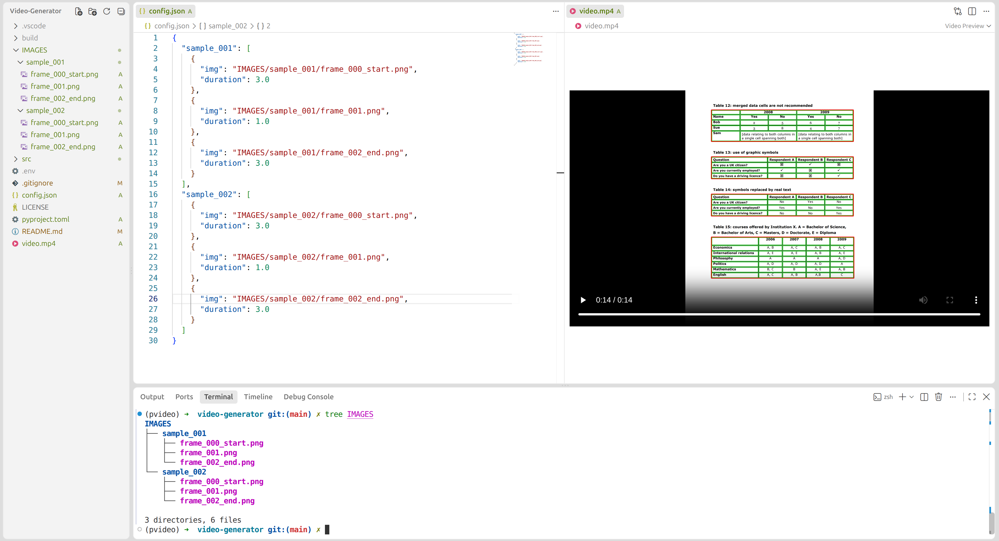

# 🎬 Visual Pipeline Video Generator

A lightweight Python tool for converting step-by-step algorithmic image states into clean, ready to publish MP4 demo videos.


---

## 📺 Demo



*Deterministic **14-second** video rendering based on image order and duration config.*

---

## 💡 Why I Built This

I develop a wide range of image processing algorithms for AI systems, and recently I've been looking to expand my network and share more of the work I build.

So I started a YouTube channel to showcase these algorithms through short, visual demos.

But I didn't want to spend hours manually arranging frames in Canva, PowerPoint, or other video editors every time I wanted to publish a new demo.

So I built this.

The idea is simple: organize the image states, run the tool, and get a consistent MP4 video. This also keeps the presentation style consistent across future demos, so viewers can focus on the algorithm rather than the editing.

> **Build the algorithm. Capture the states. Generate the video. Move on to the next problem.**

*(Of course, some secret intermediate sauce is intentionally left out. Gotta keep some secrets for the videos, lol.)*

---

## 🛠️ Workflow

1. **Export Config**: Scan image folders and generate an initial `config.json`.
2. **Edit Config**: Optionally add, remove, reorder frames, or change individual durations.
3. **Render Video**: Use FFmpeg to generate the MP4 according to the configuration.

The video rendering is handled by **FFmpeg**, rather than processing video frames directly through OpenCV.

---

## 📂 Input Structure

```text
IMAGES/
├── sample_001/
│   ├── frame_000_start.png
│   ├── frame_001.png
│   └── frame_002_end.png
└── sample_002/
    ├── frame_000_start.png
    ├── frame_001.png
    └── frame_002_end.png
```

Each subfolder represents one sample, with images representing successive processing stages.

Frames are ordered deterministically by:

1. Subfolder name
2. Image name

Zero-padded filenames are recommended:

```text
frame_001.png
frame_002.png
frame_010.png
```

---

## 🎛️ Configuration

The generated `config.json` is fully editable. You can freely change the image path, add/remove/reorder frames, and adjust the duration of any frame.

```json
{
  "sample_001": [
    {
      "img": "IMAGES/sample_001/frame_000_start.png",
      "duration": 3.0
    },
    {
      "img": "IMAGES/sample_001/frame_001.png",
      "duration": 1.0
    }
  ]
}
```

* **`img`**: Path to any image you want to include in the video.
* **`duration`**: Display duration of the frame in seconds.
* Frame order: The order in `config.json` is exactly the order used in the generated video.

This allows the configuration to be generated automatically and then fine-tuned manually whenever needed.

---

## 🚀 Usage

### 1. Install

```bash
pip install -e .
```

Create a `.env` file:

```env
SRC_IMAGE_DIRS = "IMAGES"
CONFIG = "config.json"
DST_VIDEO = "video.mp4"
DEFAULT_DURATION = 1.0
FIRST_DURATION = 2.0
LAST_DURATION = 2.0
DEFAULT_WIDTH = 2560
DEFAULT_HEIGHT = 1440
DEFAULT_CRF = 18
MAX_IMAGES = 1000
```

Make sure **FFmpeg** is installed and available in your system `PATH`, If not, install it using your system package manager:

* macOS:

  ```bash
  brew install ffmpeg
  ```

* Ubuntu / Debian:

  ```bash
  sudo apt update
  sudo apt install ffmpeg
  ```

* Windows:

  ```PowerShell
  winget install --id=Gyan.FFmpeg -e
  ```

  *(Or download from ffmpeg.org and add the bin folder to your system environment PATH)*

### 2. Generate Configuration

```bash
python src/export_config.py
```

### 3. Render Video

```bash
python src/export_video.py
```

The resulting `video.mp4` is ready to use for demos, presentations, documentation, or YouTube.

---

## 🎥 Video Rendering

The renderer uses the **FFmpeg concat demuxer** to assemble the configured image sequence.

This keeps the Python side lightweight: Python handles the configuration and ordering, while FFmpeg handles the actual video encoding.

The output is rendered as:

* **2560 × 1440 (2K)**
* **16:9**
* **H.264**
* **YUV420P**
* Automatic aspect-ratio preservation
* Black padding for images that do not match the 16:9 frame
* Variable frame durations defined by `config.json`

Images with different resolutions are automatically fitted into the 2560 × 1440 output frame without distorting their aspect ratio.

---

## 🎓 Visual Documentation & Training

This tool is also useful as a lightweight visual documentation and training system for image processing pipelines.

When an algorithm contains many intermediate processing stages, it is not always obvious which state happens before or after another especially when someone else needs to understand, maintain, debug, or extend the pipeline.

Instead of relying on memory or manually documenting every step, capture the intermediate image states directly during execution.

For example:

```python
import os
from datetime import datetime
from dotenv import load_dotenv
load_dotenv()
SRC_IMAGE_DIRS = os.getenv("SRC_IMAGE_DIRS", "./IMAGES")
filename = f"{datetime.now().strftime('%Y%m%d_%H%M%S_%f')}_remove_lines.png"
save_image(
    visualize_image,
    os.path.join(SRC_IMAGE_DIRS, "sample_001", filename)
)  # saved image
```

This produces a naturally ordered sequence such as:

```text
IMAGES/sample_001/20260818_230501_123456_input.png
IMAGES/sample_001/20260818_230501_234567_threshold.png
IMAGES/sample_001/20260818_230501_345678_remove_lines.png
IMAGES/sample_001/20260818_230501_456789_detect_cells.png
IMAGES/sample_001/20260818_230501_567890_final.png
```

The timestamp preserves the actual execution order, while the descriptive filename makes each processing stage easy to identify.

Once captured, these states can be converted directly into a video, making the pipeline much easier to understand visually.

This can be useful for:

* Algorithm documentation
* Team onboarding and training
* Debugging pipelines
* Communicating processing logic

> **If you're not sure what happens before or after, don't rely on memory. Capture it at runtime.**

---

## 📜 License

This project is open-source software licensed under the [MIT License](LICENSE).
